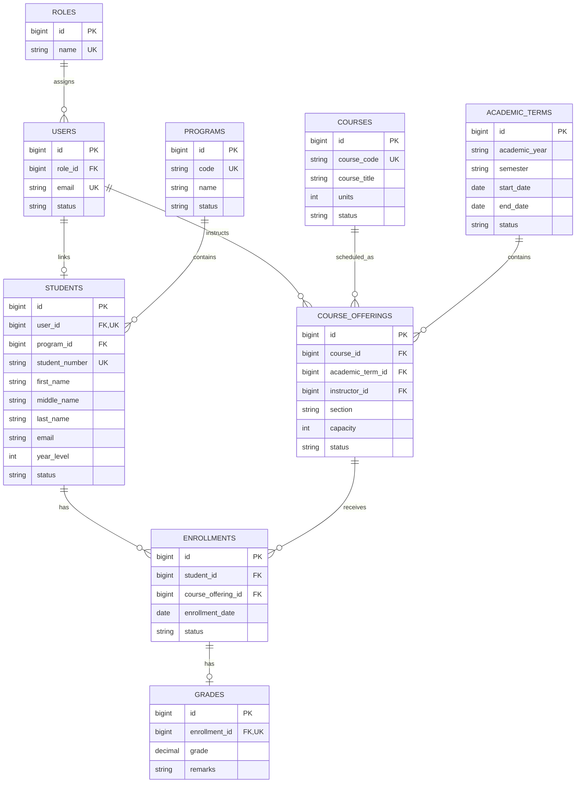

# Entity Relationship Diagram

`academic_terms` is unique on `(academic_year, semester)`, `course_offerings` on `(course_id, academic_term_id, section)`, and `enrollments` on `(student_id, course_offering_id)`.
